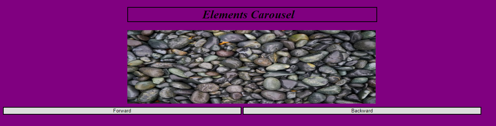

# My Awesome Carousel
A Web Application image Carousel made with HTML, CSS and JQuery!

## How It's Made:

**Tech used:** HTML, CSS, JQuery

Users can click either the forwards or backwards buttons to toggle through an image carousel containing pictures of earths elements.

## Lessons Learned:

During the construction of this web application, I learned how to toggle through an array of images and reset to the beginning once I reached the last element of the array.
